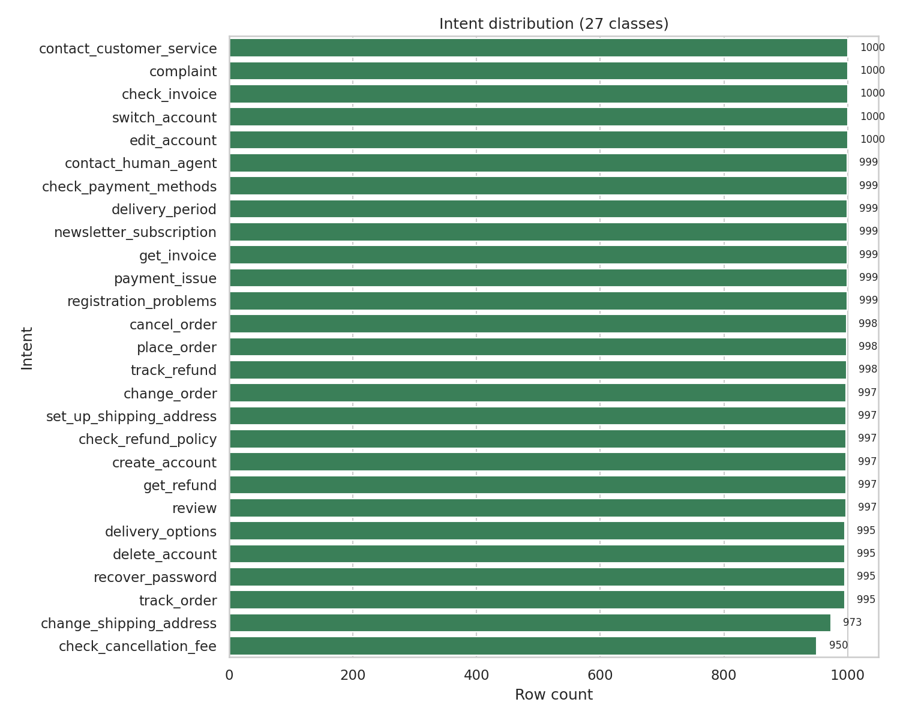
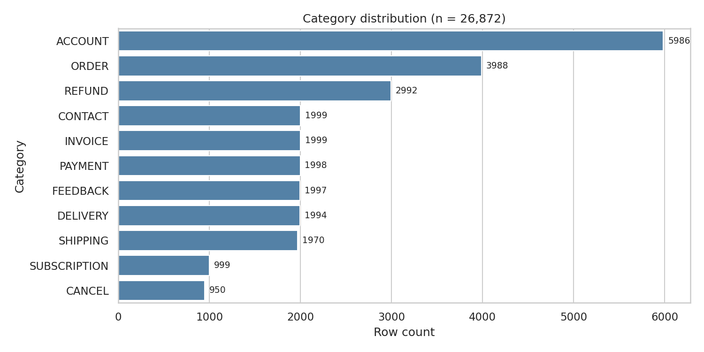
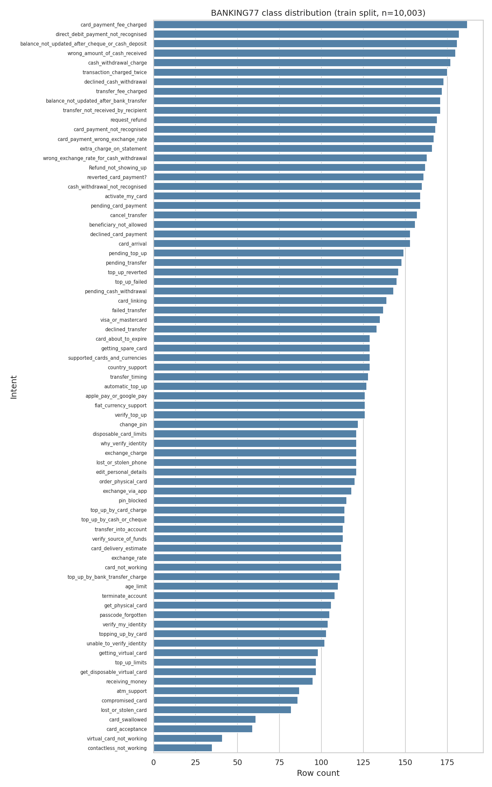
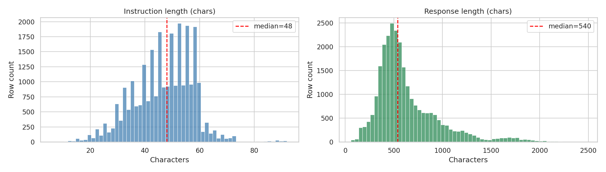
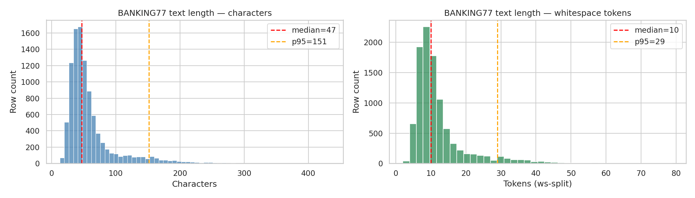
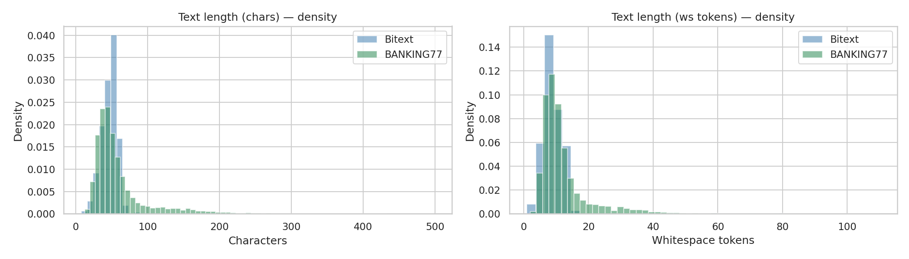

# Customer Support Intent Classification: Data Handling, Cleaning, and Statistics

**Author**: ZHONG QI
**Course**: CA6000
**Date**: 2026-04-21

---

## 1. Dataset Source, Import, and Error Detection

This project uses two English customer-support corpora to compare intent-classification
approaches across both templated synthetic text and real user-written queries.
Dataset 1 (Bitext) is a large synthetic-augmented corpus used as the primary
training dataset. Dataset 2 (BANKING77) is a smaller, real-user corpus used as a
noisier complement so that the downstream model comparison is not judged on
templated text alone. The same preprocessing audit (null check, duplicate
detection, encoding inspection, label-hierarchy validation) was applied to both.

### 1.1 Primary dataset: Bitext Customer Support LLM Chatbot Training Dataset

**Source.** `bitext/Bitext-customer-support-llm-chatbot-training-dataset` on
HuggingFace Hub (also mirrored on Kaggle). License: CDLA-Sharing-1.0
(Community Data License Agreement — Sharing, v1.0).

**Purpose.** English customer-service intent detection. Each row pairs a
customer message (`instruction`) with a canonical agent reply (`response`)
and is annotated with a coarse `category` and a fine-grained `intent` in a
hierarchical label scheme.

**Import method.** The dataset was pulled once from HuggingFace using
`datasets.load_dataset` and serialised to a local parquet file
(`data/raw/bitext_customer_support.parquet`, 5.96 MB). Subsequent notebook
runs load the immutable local copy via `pandas.read_parquet` so the raw
inputs cannot drift between sessions.

**Shape and schema.** After load, the DataFrame has shape `(26872, 5)` and
the following columns, all of dtype `object`:

| Column | Description |
|---|---|
| `flags` | Augmentation tags (letters B, L, Q, Z, etc.) indicating colloquial / polite / typo variants |
| `instruction` | Customer message — the classification input |
| `category` | Coarse label (11 values, upper-case) |
| `intent` | Fine-grained label (27 values) |
| `response` | Canonical agent reply |

**Error detection performed.** Before any cleaning, the raw DataFrame was
audited for the defect classes below (notebook `01_data_exploration.ipynb`,
Section 4).

| Check | Raw Bitext result |
|---|---|
| Null / NaN values (any column) | 0 rows |
| Empty or whitespace-only strings | 0 rows (all 5 object columns) |
| Exact duplicate rows | 0 |
| Duplicates on (`instruction`, `response`) | 0 |
| Duplicates on `instruction` alone | 2,237 (paraphrase re-use — retained as legitimate signal) |
| Leading / trailing whitespace in `instruction` | 0 |
| Internal multi-space in `instruction` | 551 |
| Tabs in `instruction` | 0 |
| Non-ASCII in `instruction` | 0 |
| Non-ASCII in `response` | 111 |
| Mojibake signatures in `instruction` / `response` | 0 / 0 |
| Intents mapped to more than one category (hierarchy violation) | 0 |
| `instruction` length > 500 chars | 0 |
| `response` length > 2000 chars | 112 |

The raw Bitext dump is effectively pristine: no nulls, no exact duplicates, no
mojibake, and the 11-category / 27-intent hierarchy is invariant (every intent
maps to exactly one category). The only non-trivial finding is 551 rows with
internal multi-space in `instruction`, which is cosmetic. This cleanliness
is consistent with the dataset being programmatically generated from templates
rather than collected from real support logs.

### 1.2 Second dataset: BANKING77

**Source.** `PolyAI/banking77` on HuggingFace Hub. License: CC-BY-4.0.
Citation: Casanueva et al., *Efficient Intent Detection with Dual Sentence
Encoders*, NLP4ConvAI 2020.

**Purpose.** A real-user complement to the templated Bitext data. The contrast
enables a cross-domain comparison of the same three classifier architectures
against both a tidy synthetic distribution and a noisy real-user distribution.

**Import method.** Pulled directly via `datasets.load_dataset("PolyAI/banking77")`
and converted to pandas with `ds["train"].to_pandas()` and
`ds["test"].to_pandas()`. The integer `label` column carries a HuggingFace
`ClassLabel` feature, so the 77 intent names were materialised once via
`label_names = ds["train"].features["label"].names` and mapped onto a new
`label_name` string column in both splits.

**Shape and schema.** Two native splits, no validation set:

| Split | Rows | Columns |
|---|---|---|
| `train` | 10,003 | `text` (object), `label` (int64), `label_name` (object, derived) |
| `test` | 3,080 | same |

Total raw rows: 13,083. No category hierarchy and no agent reply — the task is
flat 77-way classification on user text.

**Error detection performed.** The same audit function (`audit()` in
notebook `07_banking77_exploration.ipynb`, Section 4) was applied to both
splits. Unlike Bitext, the raw issues discovered here are genuine artefacts
of the upstream release and were not injected.

| Check | Train | Test |
|---|---|---|
| Null `text` / Null `label` | 0 / 0 | 0 / 0 |
| Empty or whitespace-only `text` | 0 | 0 |
| Exact duplicate rows | 0 | 0 |
| Duplicates on (`text`, `label`) (raw) | 0 | 0 |
| Leading / trailing whitespace | 9 | 3 |
| Internal multi-space | 454 | 100 |
| Embedded newlines | 10 | 3 |
| Non-ASCII characters | 52 | 9 |
| Mojibake signatures | 0 | 0 |
| Text > 300 chars | 20 | 3 |
| Raw-text overlap between train and test | 0 | — |

The BANKING77 audit is noisier than Bitext's in a structurally different way.
There are no nulls or exact duplicates, but there are 564 rows across the two
splits carrying whitespace artefacts (leading, trailing, internal, newlines),
61 rows with non-ASCII characters (dominated by currency symbols such as `£`
and `€`), and 23 rows exceeding 300 chars. One of the 77 label names carries
non-lowercase casing (`Refund_not_showing_up`) and another carries a trailing
punctuation character (`reverted_card_payment?`); both are kept verbatim
because downstream models must predict the exact string released by
PolyAI.

A second-order issue surfaces only after whitespace normalisation (reported
in Section 2.2): five duplicate `(text, label)` pairs within splits and seven
cross-split leakage pairs that were masked in the raw strings by stray
newlines or double-spaces.

---

## 2. Error Fixing with Pandas

CA6000 Spec #2 requires demonstrating error-fixing with pandas techniques and
permits deliberately injecting errors when a dataset is already clean. The
Bitext pipeline (Section 2.1) follows the injection pathway because the raw
dump is pristine; the BANKING77 pipeline (Section 2.2) uses only genuine
upstream issues. Both datasets end with stratified train / val / test parquet
files written to `data/processed/` (Bitext) and `data/banking77/processed/`
(BANKING77).

### 2.1 Bitext cleaning operations

Because the raw Bitext frame contained zero targetable defects, notebook
`02_data_cleaning.ipynb` works on a deep-copied working frame with six
classes of synthetic errors deliberately injected at controlled rates. All
injection uses `numpy.random.default_rng(seed=42)` so the process is
reproducible. Counts below are taken from the injection log.

| Injected defect class | Rate | Count injected | Mechanism |
|---|---|---|---|
| `nan_intent` | ~5% | 1,344 | `df.loc[idx, "intent"] = np.nan` on random indices |
| `dup_rows` | ~2% | 537 | Sample random rows and concatenate copies |
| `mojibake` | ~1% | 269 | Prepend `é` and substitute `'` with `’` in `response` |
| `length_outlier` | ~1% | 269 | Repeat `instruction` 10× to exceed the 500-char cap |
| `case_inconsistency` | ~1% | 269 | Alternate `.lower()` / `.title()` on `category` |
| `ws_artefact` | ~2% | 537 | Inject leading spaces, triple-spaces, trailing tab |

Injection grew the working frame from 26,872 to 27,409 rows (the 537
duplicate-row copies are concatenated; the other classes overwrite values
in place).

**Cleaning pipeline.** A deterministic nine-step pipeline (notebook 02,
Section 5) was then applied. Each step used a standard pandas or pandas-string
primitive and recorded before / after row counts.

```python
# 1. Drop rows with NaN in the classification target
df = df.dropna(subset=["intent"]).reset_index(drop=True)

# 2. Deduplicate on (instruction, intent)
df = df.drop_duplicates(subset=["instruction", "intent"], keep="first")

# 3. Collapse internal whitespace on instruction + response
df["instruction"] = df["instruction"].map(lambda s: " ".join(s.split()))
df["response"]    = df["response"].map(lambda s: " ".join(s.split()))

# 4. Repair mojibake byte signatures BEFORE NFKC (ordering matters)
df["response"] = (
    df["response"]
      .str.replace("’", "'", regex=False)
      .str.replace("“", '"', regex=False)
      .str.replace("é",  "",  regex=False)
)

# 5. Unicode NFKC normalise
df["instruction"] = df["instruction"].map(lambda s: unicodedata.normalize("NFKC", s))
df["response"]    = df["response"].map(lambda s: unicodedata.normalize("NFKC", s))

# 6. Upper-case category to the canonical ACCOUNT / ORDER / ... form
df["category"] = df["category"].str.upper()

# 7. Drop length outliers (instruction > 500 chars or response > 3000 chars)
mask_ok = (df["instruction"].str.len() <= 500) & (df["response"].str.len() <= 3000)
df = df[mask_ok].reset_index(drop=True)

# 8. Re-dedup after normalisation (whitespace collapse can expose new dupes)
df = df.drop_duplicates(subset=["instruction", "intent"], keep="first")

# 9. Assert hierarchy invariant: every intent maps to exactly one category
assert df.groupby("intent")["category"].nunique().max() == 1
```

The ordering of step 4 (byte-level mojibake repair) before step 5 (NFKC) is
load-bearing: NFKC decomposes the `’` sequence into a different,
non-invertible form, so the raw mojibake pattern must be replaced first.

**Cleaning log — row-level accounting.** The four row-count-changing steps
produce the trail in Table 2.1, drawn from
`outputs/metrics/data_stats.json` (`cleaning_log`):

| Step | Rows before | Rows after | Dropped | Note |
|---|---|---|---|---|
| `drop_nan_intent` | 27,409 | 26,048 | 1,361 | target column must be present |
| `dedup_instr_intent` | 26,048 | 23,588 | 2,460 | keep=first |
| `drop_length_outliers` | 23,588 | 23,477 | 111 | instruction<=500ch, response<=3000ch |
| `dedup_post_normalise` | 23,477 | 23,326 | 151 | remove dupes exposed by normalisation |

The 1,361 dropped NaN rows include the 1,344 injected values plus 17 rows
whose `intent` became NaN as a collateral effect of other in-place edits.
The 2,460 `(instruction, intent)` dedup drops include the 537 injected
duplicates plus the ~1,923 natural paraphrase-level repeats already present
in the raw frame (the audit in Section 1.1 recorded 2,237 `instruction`-only
duplicates; pair-level dedup is slightly more permissive than that).

**Post-cleaning audit.** Every targeted defect count drops to zero
(notebook 02, Section 6): 0 NaN intents, 0 duplicates on (`instruction`,
`intent`), 0 exact duplicate rows, 0 mojibake in `response`, 0 length
outliers, 0 non-upper-case categories, 0 leading/trailing whitespace, 0
multi-space instances, 0 tab characters. All 11 categories and all 27
intents are still present. Final cleaned row count: 23,326.

### 2.2 BANKING77 cleaning operations

BANKING77 is real data and required no synthetic injection. Notebook
`08_banking77_cleaning.ipynb` applies a smaller, targeted pipeline:

```python
# 1. Collapse internal whitespace + strip leading/trailing on text
df["text"] = df["text"].map(lambda s: " ".join(s.split()))

# 2. Unicode NFKC normalise
df["text"] = df["text"].map(lambda s: unicodedata.normalize("NFKC", s))

# 3. Drop rows where text became empty after normalisation (no such rows arose)
df = df[df["text"].str.len() > 0].reset_index(drop=True)

# 4. Deduplicate on (text, label), keep first
df = df.drop_duplicates(subset=["text", "label"], keep="first")
```

Length outliers (> 300 chars) and non-ASCII characters (currency symbols and
accented names) were flagged but retained because both are legitimate features
of real user queries. Label names were preserved verbatim including the one
mixed-case and one trailing-question-mark entries, since the downstream
classifiers must predict the canonical string released by PolyAI.

**Discovery by normalisation: within-split and cross-split leakage.**
The most substantive pandas-driven finding for BANKING77 is that several
duplicate and leakage pairs only become visible after whitespace
normalisation. On the raw strings, the pair-level duplicate and
train-vs-test overlap audits (Section 1.2) both returned zero. After
applying `" ".join(s.split())` followed by `unicodedata.normalize("NFKC", ...)`,
a second round of `.duplicated(subset=["text", "label"])` and of set-based
intersection across splits revealed the following:

| Defect | Count | Action |
|---|---|---|
| Within-train `(text, label)` duplicates (post-NFKC) | 4 | Dropped (10,003 → 9,999; `keep="first"`) |
| Within-test `(text, label)` duplicates (post-NFKC) | 1 | Dropped (3,080 → 3,079; `keep="first"`) |
| Cross-split `(text, label)` leakage: train vs test | 6 | Dropped from train side |
| Cross-split `(text, label)` leakage: val vs test | 1 | Dropped from val side |
| Cross-split `(text, label)` leakage: train vs val | 0 | — |
| Text > 300 chars (length outliers), train | 20 | Flagged, retained |
| Text > 300 chars (length outliers), test | 3 | Flagged, retained |
| Non-ASCII characters retained, train | 49 | Kept (currency / accents) |
| Non-ASCII characters retained, test | 9 | Kept |

The seven cross-split leakage pairs were masked in raw form by stray
leading newlines and internal double-spaces. For example,
`"\nHow do I unblock my PIN?"` (raw train) and `"How do I unblock my PIN?"`
(raw test) are distinct as bytes but identical after NFKC + whitespace
collapse. The decision rule, applied uniformly, is to drop from the
train / val side and preserve the canonical test set intact: the test
parquet is sha256-hashed and shared across all downstream models, so
modifying it retrospectively would break cross-run comparability. Dropping
the contaminating rows from train / val removes the leakage without
disturbing the pinned evaluation contract. The numerical effect of the
leakage removal, had it been left in, is approximately 7 / 3,079 ≈ 0.23
percentage points of upward accuracy inflation — small in aggregate but
unevenly distributed across the 77 classes and therefore distortionary for
per-class F1.

Final BANKING77 cleaned row count: 13,071 (9,999 train-pool + 3,079 test
less the 7 cross-split drops and 1 within-test drop, reconciled against
the pre-cleaning total of 13,083).

### 2.3 Split creation

**Bitext splits.** Stratified on `intent`, using two successive calls to
`sklearn.model_selection.train_test_split` with `random_state=42`. Round 1
allocates 75 % to `train` and 25 % to a "rest" pool. Round 2 splits the
25 % pool into `val` (40 % of rest = 10 % of total) and `test` (60 % of
rest = 15 % of total), again stratified on `intent`. Final split sizes
(from `outputs/metrics/data_stats.json.split_sizes`):

| Split | Rows | Fraction |
|---|---|---|
| `train` | 17,494 | 75.00% |
| `val` | 2,332 | 10.00% |
| `test` | 3,500 | 15.00% |
| Total cleaned | 23,326 | — |

The maximum per-intent distribution deviation between any split and the
overall cleaned frame is 0.0003 (≤ 0.03 percentage points), and
`(instruction, intent)` pairs are disjoint across splits (zero leakage).

**BANKING77 splits.** PolyAI's native `test` split (3,080 rows cleaned to
3,079) is preserved as-is and functions as the canonical evaluation set.
The cleaned `train` pool (9,999 rows) is split 88 / 12 on `label` via a
single stratified `train_test_split` call with `random_state=42`. Six
rows are subsequently removed from train (leakage vs test) and one row
from val (leakage vs test), producing the final sizes (from
`outputs/metrics/banking77_stats.json.cleaning.split_sizes`):

| Split | Rows | Note |
|---|---|---|
| `train` | 8,793 | 88 % stratified carve-out, minus 6 leakage drops |
| `val` | 1,199 | 12 % stratified carve-out, minus 1 leakage drop |
| `test` | 3,079 | HF native test, less 1 within-test duplicate |
| Cleaned HF train pool (pre-split) | 9,999 | — |
| Cleaned HF test pool | 3,079 | Pinned for evaluation |

Every one of the 77 classes appears in every split (maximum per-class
distribution deviation between the stratified train split and the overall
cleaned train pool is 0.0011 ≈ 0.11 percentage points).

**Test-set reproducibility.** Both test parquet files are sha256-hashed
and the hashes are recorded in the project's results JSON so any
downstream model can verify it is evaluating on bit-identical bytes:

- Bitext test: `sha256:5641a8ab0fb4814b` (from
  `outputs/metrics/data_stats.json` and every Bitext `results.json`;
  truncated form used by the Bitext evaluation scripts).
- BANKING77 test: `sha256:6b7f43ccbe394d73310fa8d23ac97cebf9ce1292e989bca5f6001c52d8e33ddc`
  (from `outputs/metrics/banking77_test_hash.txt` and every BANKING77
  `results.json`).

---

## 3. Dataset Statistics

This section summarises structural and distributional properties of the two
cleaned datasets. All values are aggregated over the combined
train + val + test parquet files written in Section 2 unless otherwise
noted.

### 3.1 Summary table

Table 3.1 consolidates the core descriptors side by side, with all values
traced to `outputs/consolidated/datasets_summary.json`.

| Metric | Bitext | BANKING77 |
|---|---|---|
| Total rows after cleaning | 23,326 | 13,071 |
| Number of intents | 27 | 77 |
| Number of categories | 11 | N/A (flat) |
| Train split (rows) | 17,494 | 8,793 |
| Val split (rows) | 2,332 | 1,199 |
| Test split (rows) | 3,500 | 3,079 |
| Class imbalance ratio (max/min, combined cleaned) | 1.05 (intent) / 6.30 (category) | 3.03 |
| Class imbalance ratio (max/min, raw train) | — | 5.34 (min 35, max 187) |
| Mean text length (chars) | 49.26 | 58.19 |
| Std text length (chars) | 30.68 | 39.47 |
| Median text length (chars) | 48.0 | 46.0 |
| p95 text length (chars) | 61.0 | 145.0 |
| Max text length (chars) | 499.0 | 429.0 |
| Mean text length (words) | 9.25 | 11.72 |
| Median text length (words) | 9.0 | 10.0 |
| p95 text length (words) | 13.0 | 28.0 |
| Max text length (words) | 120.0 | 79.0 |
| Test-set sha256 prefix (reproducibility pin) | `5641a8ab0fb4814b` (sorted-CSV method) | `6b7f43ccbe394d73` (file-bytes method) |

*Table 3.1. Side-by-side descriptive statistics. Text-length values are
computed over the classification input column (`instruction` for Bitext,
`text` for BANKING77).*

### 3.2 Class distribution

**Bitext intent distribution (27 classes).** Using raw-dump counts from
notebook 01 (the distribution is preserved by stratified splitting), intents
range from 950 (`check_cancellation_fee`) to 1,000 (multiple intents including
`contact_customer_service`, `complaint`, `check_invoice`). The imbalance
ratio max/min is 1.05, i.e. near-uniform. At the category level the ratio is
6.30 (min 950 for `CANCEL`, max 5,986 for `ACCOUNT`) because several intents
collapse under a shared category.



*Figure 3.1. Bitext intent distribution. 27 classes are near-uniform
(imbalance ratio 1.05).*



*Figure 3.2. Bitext category distribution. 11 categories, imbalance
ratio 6.30 driven by `ACCOUNT` (5,986 rows) versus `CANCEL` (950 rows).*

**BANKING77 class distribution (77 classes).** On the raw 10,003-row train
split, counts range from 35 (`contactless_not_working`) to 187
(`card_payment_fee_charged`), giving an imbalance ratio of 5.34. On the
combined cleaned train + val + test totals (n = 13,071), the range widens in
absolute terms but the ratio narrows to 3.03 (min 75, max 227). Every one
of the 77 classes has at least 35 samples in raw train (≥ 9 after a 12 %
val carve-out), so stratified splitting on `label` is feasible without
merging or oversampling.



*Figure 3.3. BANKING77 class distribution on the raw 10,003-row train
split. Imbalance ratio max/min is 5.34 (min 35, max 187).*

### 3.3 Text length distribution

**Bitext.** The `instruction` column has mean 49.26 chars, standard deviation
30.68 chars, median 48.0 chars, p95 61.0 chars, and max 499.0 chars.
Whitespace-token counts follow the same shape: mean 9.25, median 9.0,
p95 13.0, max 120.0. The distribution is tightly concentrated around the
median with a short right tail (Figure 3.4, left panel) — a signature of
templated text generation. The right panel of Figure 3.4 shows the
`response` column, which is much longer (median 540 chars, p95 1,295 chars)
and is not used for classification in this project.



*Figure 3.4. Bitext text-length distributions in characters. The left
panel (instruction) is the classification input; the right panel (response)
is included for completeness. Median lines are overlaid.*

**BANKING77.** The `text` column has mean 58.19 chars, standard deviation
39.47 chars, median 46.0 chars, p95 145.0 chars, and max 429.0 chars. In
whitespace tokens, the mean is 11.72, median 10.0, p95 28.0, max 79.0.
The median is very close to Bitext's (46 vs 48 chars), but the distribution
is much more heavy-tailed — the BANKING77 p95 of 145 chars is more than
double Bitext's 61, and the p99 reaches 215 chars (Figure 3.5).



*Figure 3.5. BANKING77 text-length distribution on the raw train split.
Characters (left) and whitespace tokens (right); median and p95 lines are
overlaid.*

**Side-by-side contrast.** Figure 3.6 overlays the two distributions in
density form. Near the median the two corpora occupy a similar range,
but Bitext is concentrated and near-unimodal (consistent with templated
generation) whereas BANKING77 has a longer right tail reflecting the
variable length of real user queries.



*Figure 3.6. Density comparison of text lengths between Bitext and
BANKING77. Both distributions peak around the same median but BANKING77
has a noticeably longer right tail in both character and
whitespace-token space.*

### 3.4 Qualitative contrast

Ten random samples (seed 42) were drawn from each dataset in
`07_banking77_exploration.ipynb`, Section 7. Five from each are reproduced
in Table 3.2 for descriptive comparison.

| Source | Intent / label | Text |
|---|---|---|
| BANKING77 | `change_pin` | Is it possible for me to change my PIN number? |
| BANKING77 | `declined_card_payment` | I'm not sure why my card didn't work |
| BANKING77 | `top_up_failed` | I don't think my top up worked |
| BANKING77 | `card_payment_fee_charged` | Can you explain why my payment was charged a fee? |
| BANKING77 | `balance_not_updated_after_bank_transfer` | How long does a transfer from a UK account take? I just made one and it doesn't seem to be working, wondering if everything is okay |
| Bitext | `check_cancellation_fee` | assistance seeing the termination penalty |
| Bitext | `track_refund` | where could I check the current status of the compensation? |
| Bitext | `create_account` | I need information about opening a `{{Account Category}}` account |
| Bitext | `recover_password` | I don't know what I have to do to reset my pass |
| Bitext | `payment_issue` | assistancesolving a trouble with payment |

*Table 3.2. Random samples (seed 42) from each cleaned dataset.*

The Bitext rows are short (typically fewer than ten words), often lower-case,
include unresolved template placeholders such as `{{Account Category}}` and
`{{Order Number}}`, and occasionally contain deliberate typographical
artefacts (e.g. `assistancesolving`, `pass` for `password`) associated with
the `Z` augmentation flag. The BANKING77 rows are formed as natural
questions ("Is it possible for me…", "Can you explain why…", "How long does
a transfer…"), use standard punctuation, and carry no placeholder tokens.
They also span a wider length range: the last example in Table 3.2 is 143
characters, which exceeds Bitext's p95 length of 61 characters. This
syntactic and lexical contrast underpins the decision to evaluate all three
downstream classifiers on both datasets rather than on one alone.
