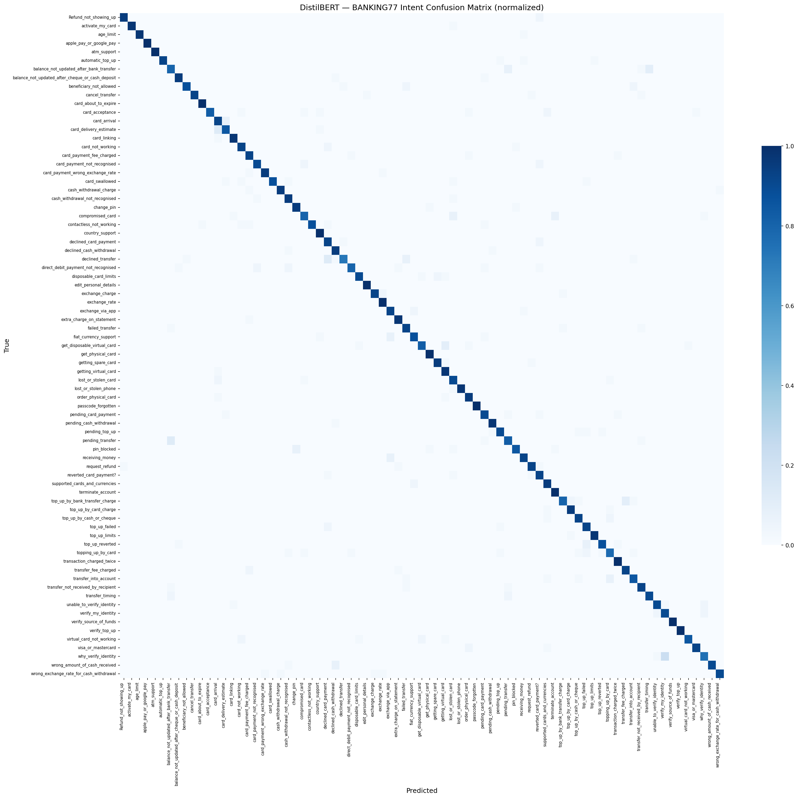
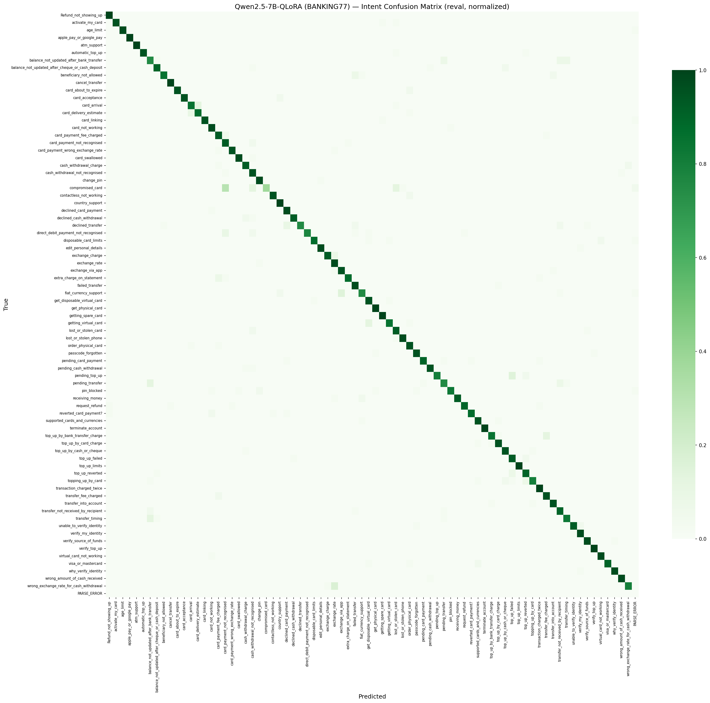

# Customer Support Intent Classification: Data Handling, Cleaning, and Statistics

**Author**: ZHONG QI
**Course**: CA6000
**Date**: 2026-04-21

---

## 1. Dataset Source, Import, and Error Detection

This project uses two English customer-support corpora: Bitext (a large
synthetic-augmented corpus) as the primary training dataset, and BANKING77 (a
smaller real-user corpus) as a noisier complement. The same preprocessing audit
(nulls, duplicates, encoding, label-hierarchy validation) was applied to both.

### 1.1 Primary dataset: Bitext Customer Support LLM Chatbot Training Dataset

**Source.** `bitext/Bitext-customer-support-llm-chatbot-training-dataset` on
HuggingFace Hub (licence CDLA-Sharing-1.0). Each row pairs a customer
`instruction` with a canonical `response` and is annotated with a coarse
`category` (11 values) and fine-grained `intent` (27 values) in a hierarchical
label scheme. Pulled once via `datasets.load_dataset` and serialised to a local
parquet (`data/raw/bitext_customer_support.parquet`, 5.96 MB). Loaded shape:
`(26872, 5)`; all columns dtype `object` (`flags`, `instruction`, `category`,
`intent`, `response`).

**Error detection performed** (notebook `01_data_exploration.ipynb`, Section 4):

| Check | Raw Bitext result |
|---|---|
| Null / NaN values (any column) | 0 rows |
| Empty or whitespace-only strings | 0 rows |
| Exact duplicate rows | 0 |
| Duplicates on (`instruction`, `response`) | 0 |
| Duplicates on `instruction` alone | 2,237 (paraphrase re-use — retained) |
| Internal multi-space in `instruction` | 551 |
| Non-ASCII in `instruction` / `response` | 0 / 111 |
| Mojibake signatures in `instruction` / `response` | 0 / 0 |
| Intent-to-category hierarchy violations | 0 |
| `instruction` > 500 chars / `response` > 2000 chars | 0 / 112 |

The raw dump is effectively pristine — no nulls, no exact duplicates, no
mojibake, hierarchy invariant — consistent with programmatic template
generation rather than real support logs.

### 1.2 Second dataset: BANKING77

**Source.** `PolyAI/banking77` on HuggingFace Hub (licence CC-BY-4.0;
Casanueva et al., NLP4ConvAI 2020). Flat 77-way classification on real user
text; no category hierarchy, no agent reply. Pulled via
`datasets.load_dataset("PolyAI/banking77")`; the 77 intent names were
materialised onto a `label_name` column via the `ClassLabel` feature.
Native splits: `train` (10,003 rows), `test` (3,080 rows); total 13,083.

**Error detection performed** (notebook `07_banking77_exploration.ipynb`,
Section 4):

| Check | Train | Test |
|---|---|---|
| Null `text` / Null `label` | 0 / 0 | 0 / 0 |
| Exact duplicate rows / `(text, label)` duplicates (raw) | 0 / 0 | 0 / 0 |
| Leading / trailing whitespace | 9 | 3 |
| Internal multi-space / embedded newlines | 454 / 10 | 100 / 3 |
| Non-ASCII characters | 52 | 9 |
| Text > 300 chars | 20 | 3 |
| Raw-text overlap between train and test | 0 | — |

Unlike Bitext, these are genuine upstream artefacts. 564 rows carry
whitespace artefacts, 61 carry non-ASCII (dominated by `£`, `€`), 23 exceed
300 chars. Two label names are kept verbatim despite irregular casing
(`Refund_not_showing_up`) or trailing punctuation (`reverted_card_payment?`)
because downstream models must predict the exact PolyAI string. A
second-order issue — duplicates and cross-split leakage masked in raw form
by stray whitespace — surfaces only after normalisation and is reported in
Section 2.2.

---

## 2. Error Fixing with Pandas

CA6000 Spec #2 permits injecting errors when a dataset is already clean.
The Bitext pipeline (Section 2.1) uses synthetic injection because the raw
dump is pristine; BANKING77 (Section 2.2) uses only genuine upstream issues.
Both end with stratified train/val/test parquet files under `data/processed/`
and `data/banking77/processed/` respectively.

### 2.1 Bitext cleaning operations

Six classes of synthetic errors were injected into a deep-copied working
frame using `numpy.random.default_rng(seed=42)` for reproducibility:

| Injected defect | Rate | Count | Mechanism |
|---|---|---|---|
| `nan_intent` | ~5% | 1,344 | `df.loc[idx, "intent"] = np.nan` |
| `dup_rows` | ~2% | 537 | Sample and concatenate row copies |
| `mojibake` | ~1% | 269 | Prepend `é` / substitute `’` in `response` |
| `length_outlier` | ~1% | 269 | Repeat `instruction` 10× past 500-char cap |
| `case_inconsistency` | ~1% | 269 | Alternate `.lower()` / `.title()` on `category` |
| `ws_artefact` | ~2% | 537 | Inject leading spaces, triple-spaces, tab |

Injection grew the frame from 26,872 to 27,409 rows. A deterministic nine-step
cleaning pipeline was then applied (notebook `02_data_cleaning.ipynb`,
Section 5):

| Step | Operation | Purpose |
|---|---|---|
| 1 | `df.dropna(subset=["intent"])` | Drop rows missing classification target |
| 2 | `df.drop_duplicates(subset=["instruction","intent"])` | Pair-level dedup |
| 3 | `" ".join(s.split())` on `instruction`/`response` | Collapse internal whitespace |
| 4 | `.str.replace("’","'")`, `"é"→""`, `"“"→'"'` | Byte-level mojibake repair |
| 5 | `unicodedata.normalize("NFKC", s)` on text columns | Unicode canonicalisation |
| 6 | `df["category"].str.upper()` | Canonicalise category casing |
| 7 | Length mask `instruction≤500`, `response≤3000` | Drop length outliers |
| 8 | Re-dedup on `(instruction, intent)` | Remove dupes exposed by normalisation |
| 9 | `assert groupby("intent")["category"].nunique().max() == 1` | Hierarchy invariant |

Step 4 must precede step 5: NFKC decomposes the `’` sequence into a
non-invertible form, so byte-level mojibake repair must run first.

**Row-level accounting** (from `outputs/metrics/data_stats.json.cleaning_log`):

| Step | Rows before | Rows after | Dropped |
|---|---|---|---|
| `drop_nan_intent` | 27,409 | 26,048 | 1,361 |
| `dedup_instr_intent` | 26,048 | 23,588 | 2,460 |
| `drop_length_outliers` | 23,588 | 23,477 | 111 |
| `dedup_post_normalise` | 23,477 | 23,326 | 151 |

Post-cleaning audit: every targeted defect count drops to zero and all 11
categories / 27 intents remain present. Final cleaned row count: **23,326**.

### 2.2 BANKING77 cleaning operations

BANKING77 required no injection. The targeted pipeline: (1) collapse internal
whitespace via `" ".join(s.split())`, (2) NFKC normalise, (3) drop rows that
became empty (none did), (4) dedup on `(text, label)` with `keep="first"`.
Length outliers (>300 chars) and non-ASCII rows (currency symbols, accented
names) were flagged but retained as legitimate real-user features. Label
names were preserved verbatim (including `Refund_not_showing_up` and
`reverted_card_payment?`) because models must predict PolyAI's canonical
strings.

**Discovery by normalisation: within-split and cross-split leakage.**
The most substantive pandas-driven finding is that duplicate and leakage
pairs are invisible on raw bytes but emerge after whitespace/NFKC
normalisation. For example, `"\nHow do I unblock my PIN?"` (raw train) and
`"How do I unblock my PIN?"` (raw test) are distinct as bytes but identical
post-normalisation. A second pass of `.duplicated(subset=["text","label"])`
and set-based cross-split intersection revealed:

| Defect | Count | Action |
|---|---|---|
| Within-train `(text, label)` duplicates (post-NFKC) | 4 | Dropped (10,003 → 9,999) |
| Within-test `(text, label)` duplicates (post-NFKC) | 1 | Dropped (3,080 → 3,079) |
| Cross-split leakage: train vs test | 6 | Dropped from train side |
| Cross-split leakage: val vs test | 1 | Dropped from val side |
| Cross-split leakage: train vs val | 0 | — |
| Text > 300 chars (train / test) | 20 / 3 | Flagged, retained |
| Non-ASCII retained (train / test) | 49 / 9 | Kept |

The decision rule — applied uniformly — is to drop from the train/val side
and preserve the canonical test set intact, because the test parquet is
sha256-hashed and shared across all downstream models; modifying it would
break cross-run comparability. Left in, the seven cross-split pairs would
have inflated accuracy by ≈ 7/3,079 ≈ 0.23 pp, unevenly distributed across
the 77 classes and therefore distortionary for per-class F1. Final
BANKING77 cleaned row count: **13,071**.

### 2.3 Split creation

**Bitext.** Stratified on `intent` via two successive
`train_test_split` calls (`random_state=42`): 75% train, then the 25%
remainder split 40/60 into val/test.

| Split | Rows | Fraction |
|---|---|---|
| `train` | 17,494 | 75.00% |
| `val` | 2,332 | 10.00% |
| `test` | 3,500 | 15.00% |
| Total cleaned | 23,326 | — |

Max per-intent distribution deviation ≤ 0.0003; `(instruction, intent)`
pairs disjoint across splits.

**BANKING77.** PolyAI's native `test` (cleaned to 3,079) is preserved
as the canonical evaluation set. The 9,999-row train pool is split 88/12
stratified on `label`, then six train-side and one val-side leakage rows
are removed.

| Split | Rows | Note |
|---|---|---|
| `train` | 8,793 | 88% carve-out − 6 leakage drops |
| `val` | 1,199 | 12% carve-out − 1 leakage drop |
| `test` | 3,079 | HF native test − 1 within-test duplicate |

All 77 classes appear in every split (max per-class deviation ≈ 0.0011).

**Test-set reproducibility.** Both test parquets are sha256-hashed and
the hashes are pinned in every `results.json`:
- Bitext test: `sha256:5641a8ab0fb4814b…` (sorted-CSV method)
- BANKING77 test: `sha256:6b7f43ccbe394d73310fa8d23ac97cebf9ce1292e989bca5f6001c52d8e33ddc` (file-bytes)

---

## 3. Dataset Statistics

All values below are aggregated over the combined train+val+test parquet files
from Section 2 and are traced to `outputs/consolidated/datasets_summary.json`.

### 3.1 Summary table

| Metric | Bitext | BANKING77 |
|---|---|---|
| Total rows after cleaning | 23,326 | 13,071 |
| Number of intents | 27 | 77 |
| Number of categories | 11 | N/A (flat) |
| Train split (rows) | 17,494 | 8,793 |
| Val split (rows) | 2,332 | 1,199 |
| Test split (rows) | 3,500 | 3,079 |
| Class imbalance ratio (max/min, combined cleaned) | 1.05 (intent) / 6.30 (category) | 3.03 |
| Class imbalance ratio (max/min, raw train) | — | 5.34 (min 35, max 187) |
| Mean text length (chars) | 49.26 | 58.19 |
| Std text length (chars) | 30.68 | 39.47 |
| Median text length (chars) | 48.0 | 46.0 |
| p95 text length (chars) | 61.0 | 145.0 |
| Max text length (chars) | 499.0 | 429.0 |
| Mean text length (words) | 9.25 | 11.72 |
| Median text length (words) | 9.0 | 10.0 |
| p95 text length (words) | 13.0 | 28.0 |
| Max text length (words) | 120.0 | 79.0 |
| Test-set sha256 prefix (reproducibility pin) | `5641a8ab0fb4814b` (sorted-CSV method) | `6b7f43ccbe394d73` (file-bytes method) |

*Table 3.1. Side-by-side descriptive statistics. Text-length values are
computed over the classification input column (`instruction` for Bitext,
`text` for BANKING77).*

### 3.2 Class distribution

**Bitext (27 intents, 11 categories).** Intent counts range 950–1,000 across
the 27 classes (imbalance ratio 1.05, near-uniform). Category-level ratio is
6.30 (`CANCEL` 950 rows vs `ACCOUNT` 5,986) because multiple intents collapse
under shared categories.

*Figure 3.1. Bitext intent distribution (27 classes, ratio 1.05).*

*Figure 3.2. Bitext category distribution (11 categories, ratio 6.30).*

**BANKING77 (77 intents).** Raw-train counts range 35 (`contactless_not_working`)
to 187 (`card_payment_fee_charged`), ratio 5.34. On combined cleaned totals
(n=13,071) the ratio narrows to 3.03 (min 75, max 227). Every class has ≥35
raw-train samples, so stratified splitting is feasible without merging.

*Figure 3.3. BANKING77 raw-train class distribution (ratio 5.34).*

### 3.3 Text length distribution

Bitext's `instruction` is tightly concentrated around its median (mean 49.26
chars, std 30.68, p95 61) — a signature of templated generation. BANKING77's
`text` has a comparable median (46 vs 48 chars) but is much more heavy-tailed
(std 39.47, p95 145, p99 215), reflecting variable real-user query length.
The `response` column in Bitext is longer (median 540 chars, p95 1,295) but
is not used for classification.

*Figure 3.4. Bitext text-length distributions (characters). Left:
`instruction` (classification input). Right: `response`.*

*Figure 3.5. BANKING77 text-length distribution on the raw train split
(characters left, tokens right).*

*Figure 3.6. Density comparison: both peak near the same median, but
BANKING77 has a longer right tail.*

### 3.4 Qualitative contrast

A small random sample (seed 42; full set in
`07_banking77_exploration.ipynb`, Section 7) illustrates the stylistic gap:

| Source | Intent | Text |
|---|---|---|
| BANKING77 | `change_pin` | Is it possible for me to change my PIN number? |
| BANKING77 | `balance_not_updated_after_bank_transfer` | How long does a transfer from a UK account take? I just made one and it doesn't seem to be working, wondering if everything is okay |
| Bitext | `create_account` | I need information about opening a `{{Account Category}}` account |
| Bitext | `payment_issue` | assistancesolving a trouble with payment |

Bitext rows are short, often lower-case, contain unresolved template
placeholders (`{{Account Category}}`) and deliberate typographical artefacts
(e.g. `assistancesolving`, `pass` for `password`) from the `Z` augmentation
flag. BANKING77 rows are natural questions with standard punctuation, no
placeholders, and span a wider length range. This contrast motivates
evaluating all three classifiers on both corpora.

---

## 4. Neural Network Architectures

### 4.1 Model overview

This project trains a 2×3 experiment grid: three classifier families × two
datasets (Bitext, BANKING77), yielding six runs. Two families are neural
(DistilBERT fine-tuned with a classification head; Qwen2.5-7B fine-tuned with
QLoRA in a generative-classification formulation) and serve as the primary
architectures per the CA6000 spec. The third (TF-IDF + Logistic Regression)
is a non-neural lexical baseline establishing a lower bound.

### 4.2 Baseline: TF-IDF + Logistic Regression

Unigram/bigram `TfidfVectorizer` (`min_df=2`, `max_df=0.95`, `sublinear_tf=True`)
feeds a multinomial `LogisticRegression` (`solver="saga"`, `C=1.0`,
`max_iter=1000`, `random_state=42`). Total parameters: 127,845 (Bitext,
4,734-token vocab × 27 classes) and 726,033 (BANKING77, larger vocab × 77
classes). Configs: `configs/tfidf_config.yaml`.

### 4.3 Neural architecture 1: DistilBERT fine-tuning

`distilbert-base-uncased` — a 66M-parameter encoder with 6 transformer
layers, 768 hidden dim, and 12 attention heads — with a single linear
classification head appended to the `[CLS]` pooled output (27 units for
Bitext, 77 for BANKING77). WordPiece tokenisation at `max_length=128` gives
comfortable headroom (Bitext p99 ≈ 21 tokens, BANKING77 p95 = 28).
Remaining training settings are in Table 4.1; configs:
`configs/distilbert_config.yaml`, `configs/distilbert_banking77_config.yaml`.

### 4.4 Neural architecture 2: Qwen2.5-7B with QLoRA fine-tuning

`unsloth/Qwen2.5-7B-Instruct`, a 7B decoder-only transformer, is trained in
a generative-classification formulation: base weights are loaded in 4-bit
NF4 and LoRA adapters are attached to all four self-attention
(`q,k,v,o`) and all three MLP (`gate,up,down`) projections at every
decoder layer, yielding 0.919% trainable parameters. The loss is causal-LM
next-token restricted to the response span by TRL's
`DataCollatorForCompletionOnlyLM`, which masks every token before a
`response_template` anchor (`"Category:"` for Bitext, target
`"Category: X\nIntent: Y"`; `"Intent:"` for BANKING77, target
`"Intent: <label>"`); inference is greedy and outputs are parsed via a
regex → bare-label → fuzzy-match cascade. Remaining training settings are
in Table 4.1.

### 4.5 Hyperparameter summary

| Model | Dataset | Epochs | Batch (effective) | Learning rate | Trainable params | Key config notes |
|---|---|---|---|---|---|---|
| TF-IDF + LR | Bitext | n/a (convex) | n/a | n/a (saga, `C=1.0`) | 127,845 | 1-2gram, `min_df=2`, `max_df=0.95`, sublinear TF |
| TF-IDF + LR | BANKING77 | n/a (convex) | n/a | n/a (saga, `C=1.0`) | 726,033 | Same vectoriser; 77 output classes |
| DistilBERT | Bitext | 3 | 32 | 2.0e-5 (linear, warmup=0.1) | 66,974,235 | bf16, max_length=128, early stop patience 2 on `eval_macro_f1` |
| DistilBERT | BANKING77 | 10 | 32 | 2.0e-5 (linear, warmup=0.1) | 67,012,685 | bf16; epochs raised from 5 after metric-name retro (Section 5.3) |
| Qwen2.5-7B QLoRA | Bitext | 3 | 16 (4 x 4 grad accum) | 2.0e-4 (cosine, warmup=0.03) | 40,370,176 trainable / 4,393,342,464 total | 4-bit NF4 base, LoRA r=16 alpha=32 dropout=0 on {q,k,v,o,gate,up,down}_proj, response anchor `"Category:"` |
| Qwen2.5-7B QLoRA | BANKING77 | 3 | 16 (4 x 4 grad accum) | 2.0e-4 (cosine, warmup=0.03) | 40,370,176 trainable / 4,393,342,464 total | Same LoRA config; response anchor `"Intent:"` |

*Table 4.1. Training hyperparameters for all six runs in the 2 x 3 grid.
"Effective batch" reports per-device batch size x gradient accumulation.
TF-IDF + LR rows show "n/a" for epoch-based fields because the logistic
regression is fit by saga to convergence rather than by mini-batch SGD.*

---

## 5. Training and Evaluation

### 5.1 Training infrastructure

All neural training was submitted via SLURM to CCDS-TC2's `MGPU-TC2`
partition on a single NVIDIA A40 (48GB VRAM, Ampere); TF-IDF+LR ran on CPU.
bf16 was used throughout (fp16 is unstable on A40 for 7B-scale tuning).
`seed=42` was seeded across `torch`, `numpy`, `random`, and sklearn, and the
test-set sha256 hash is pinned in every `results.json`.

### 5.2 Training and evaluation protocol

Each neural run used a three-stage protocol: (1) smoke test on ≤100 samples
/ 50 steps to verify loss decrease, collator / parser pipeline, and
checkpoint I/O; (2) full training with periodic validation (per-epoch for
DistilBERT, every 200 steps for Qwen); (3) dedicated evaluation pass over
the pinned test parquet. Primary metrics are top-1 accuracy and macro-F1;
latency is reported at p50/p95/p99 at batch size 1 (single-request profile).
For the Qwen generative classifier, parse-error rate is also tracked
(fraction of generated outputs that fail the regex → bare-label → fuzzy
cascade).

### 5.3 Training process observations

**TF-IDF + LR.** Saga converges in <2 s on both datasets (0.782 s Bitext,
1.203 s BANKING77) with no warnings.

**DistilBERT.** Bitext: 3 epochs × 17,494 rows in 57.697 s; val / test
macro-F1 exceed 0.996 by epoch 3. *BANKING77 retro.* The initial 5-epoch
run terminated at 86.00% test accuracy because `metric_for_best_model`
did not match the key emitted by `compute_metrics`, silently disabling
the best-checkpoint callback so the run loaded the epoch-1 checkpoint at
end. After aligning the metric name and extending to 10 epochs, the
retry reached 91.78% test accuracy in 105.373 s (`known_retros[0]`). The
fixed run is used throughout Section 6.

**Qwen2.5-7B QLoRA.** Bitext: 5,813.164 s (~97 min) for 3 epochs over
17,494 rows, peak GPU memory 7,166 MB. BANKING77: 2,781.031 s (~46 min)
over 8,793 rows. Both loss curves decreased monotonically. *BANKING77
evaluation retro.* The first eval pass returned 0/3,079 and 100% parse
errors. Root cause: a dual-role mismatch — the string `"Intent:"` was used
both as the `response_template` anchor for `DataCollatorForCompletionOnlyLM`
loss masking (causing the model never to learn to emit that prefix) and
as the strict regex anchor in the evaluation parser. The model was
correctly emitting bare labels immediately after the masked position. No
retraining was required; the parser was patched with a bare-label stage
plus fuzzy fallback, giving 91.65% test accuracy with 7/3,079 residual
parse errors (`parse_path_counts: {regex: 0, bare: 2972, fuzzy: 100, none: 7}`;
`known_retros[1]`).

### 5.4 Error analysis (BANKING77 per-intent)

Per-intent F1 varies substantially across the 77 classes even when aggregate
macro-F1 converges. Table 5.1 lists the five hardest BANKING77 intents
ranked by DistilBERT F1 ascending (source:
`outputs/consolidated/per_intent_comparison.csv`).

| Intent | Support | TF-IDF F1 | DistilBERT F1 | Qwen F1 | Best model |
|---|---|---|---|---|---|
| balance_not_updated_after_bank_transfer | 40 | 0.6905 | 0.7901 | 0.7229 | distilbert |
| topping_up_by_card | 40 | 0.7838 | 0.7949 | 0.8649 | qwen |
| why_verify_identity | 40 | 0.8354 | 0.8000 | 0.9750 | qwen |
| declined_transfer | 40 | 0.9067 | 0.8169 | 0.8571 | tfidf |
| pending_transfer | 40 | 0.7353 | 0.8250 | 0.7895 | distilbert |

*Table 5.1. Five hardest BANKING77 intents by DistilBERT F1 ascending.*

The hardest confusions cluster around near-synonym card-problem intents
(`virtual_card_not_working`, `card_not_working`, `compromised_card`,
`lost_or_stolen_card`, `card_about_to_expire`) — all surface-similar
"something is wrong with my card" queries. TF-IDF collapses on
`virtual_card_not_working` (F1 = 0.5185; precision 1.0 but recall 0.35),
while DistilBERT recovers to 0.9067 and Qwen to 0.9630. The inverse
appears on `compromised_card`, where Qwen regresses (F1 = 0.5455, recall
0.375) while DistilBERT holds F1 = 0.8312. Qwen's errors on this intent
concentrate on `lost_or_stolen_card` and `card_about_to_expire`
(Figure 5.1b), consistent with the Qwen2.5 base model's general-English
prior clustering these under a single "card needs replacing" concept.
The LoRA budget (0.919% trainable, three epochs) evidently cannot
overwrite that prior for this particular boundary.

*Figure 5.1a. DistilBERT BANKING77 test-set confusion matrix, row-normalised,
77×77, n=3,079.*

*Figure 5.1b. Qwen2.5-7B QLoRA BANKING77 confusion matrix (post-parser-fix
re-eval), 77×77, n=3,079. Note row-wise leakage from `compromised_card` to
`lost_or_stolen_card` / `card_about_to_expire`.*

The three Bitext confusion matrices are essentially diagonal (test macro-F1
0.9922 / 0.9981 / 0.9999) and are not embedded here; PNGs remain available
in `outputs/figures/` (`03_tfidf_confusion_matrix.png`,
`04_distilbert_confusion_matrix.png`, `06_qwen_lora_confusion_matrix.png`).

---

## 6. Final Accuracy

### 6.1 Results summary

Table 6.1 consolidates the complete 2×3 result grid, read verbatim from
`outputs/consolidated/all_runs.json.summary_table.rows`. Bitext Qwen's
`val_acc` / `val_macro_f1` are `null` in source (the Bitext Qwen run used
`eval_loss` as the best-checkpoint metric) and are displayed as "—". The
Qwen trainable count (40.37M) is shown; the 4.39B total (adapter + frozen
4-bit NF4 base) is noted inline.

| Dataset | Model | val_acc | val_macro_f1 | test_acc | test_macro_f1 | p50 (ms) | p95 (ms) | Trainable params | Train time (s) |
|---|---|---|---|---|---|---|---|---|---|
| Bitext | TF-IDF + LR | 0.9889 | 0.9882 | 0.9926 | 0.9922 | 0.76 | 0.79 | 127,845 | 0.782 |
| Bitext | DistilBERT | 0.9961 | 0.9960 | 0.9980 | 0.9981 | 4.95 | 5.22 | 66,974,235 | 57.697 |
| Bitext | Qwen2.5-7B QLoRA | — | — | 0.9997 | 0.9999 | 551.14 | 648.80 | 40,370,176 (of 4.39B total) | 5813.164 |
| BANKING77 | TF-IDF + LR | 0.8499 | 0.8422 | 0.8535 | 0.8527 | 1.47 | 1.51 | 726,033 | 1.203 |
| BANKING77 | DistilBERT | 0.9099 | 0.9081 | 0.9178 | 0.9179 | 4.89 | 5.23 | 67,012,685 | 105.373 |
| BANKING77 | Qwen2.5-7B QLoRA | 0.9124 | 0.9012 | 0.9165 | 0.9050 | 273.13 | 511.27 | 40,370,176 (of 4.39B total) | 2781.031 |

*Table 6.1. Full 2 x 3 results grid across three models and two datasets.
Values from `all_runs.json.summary_table.rows`; Bitext Qwen val fields
are null in source. p50/p95 latency is single-request (batch size 1)
on CPU for TF-IDF and on A40 for DistilBERT / Qwen. Qwen trainable
parameter count is the LoRA adapter size (40.37M); the 4.39B total
includes the frozen 4-bit NF4 base weights.*

### 6.2 Cross-dataset observation

On Bitext all three models exceed 99% test accuracy (TF-IDF 99.26%,
DistilBERT 99.80%, Qwen QLoRA 99.97%); the dataset is saturated and the
≤0.7 pp between-model gap sits within the templated-text noise floor.
BANKING77 produces a meaningful spread: TF-IDF 85.35%, DistilBERT 91.78%,
Qwen 91.65%. The two neural models exceed the lexical baseline by ~6 pp
but are tied within noise in aggregate (0.13 pp). Section 5.4 shows this
tie masks per-class disagreement — DistilBERT and Qwen make errors on
different subsets of the 77 intents. The models differ sharply on
inference cost: Qwen p50 latency is 273.13 ms vs DistilBERT 4.89 ms on
the same test set (~55×); the Qwen artefact is a 170.0 MB LoRA adapter
over a 4.39B 4-bit-quantised base, while DistilBERT is a 256.56 MB
full-parameter checkpoint.
